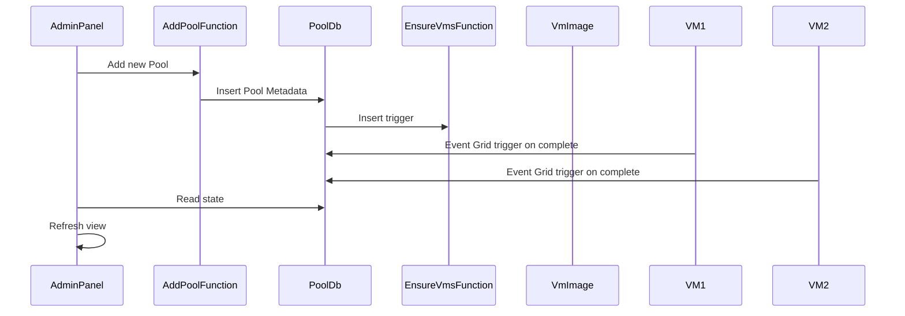

Use [Mermaid Preview Plugin for VS Code](https://marketplace.visualstudio.com/items?itemName=bierner.markdown-mermaid) to view the Mermaid diagrams on this page.

```mermaid
sequenceDiagram
    participant AdminPanel
    participant AddPoolFunction
    participant PoolDb
    participant EnsureVmsFunction
    participant VmImage
    participant VM1
    participant VM2

    AdminPanel->>AddPoolFunction: Add new Pool
    AddPoolFunction->>PoolDb: Insert Pool Metadata
    PoolDb->>EnsureVmsFunction: Insert trigger
    VM1->>PoolDb: Event Grid trigger on complete
    VM2->>PoolDb: Event Grid trigger on complete
    AdminPanel->>PoolDb: Read state
    AdminPanel->>AdminPanel: Refresh view
```